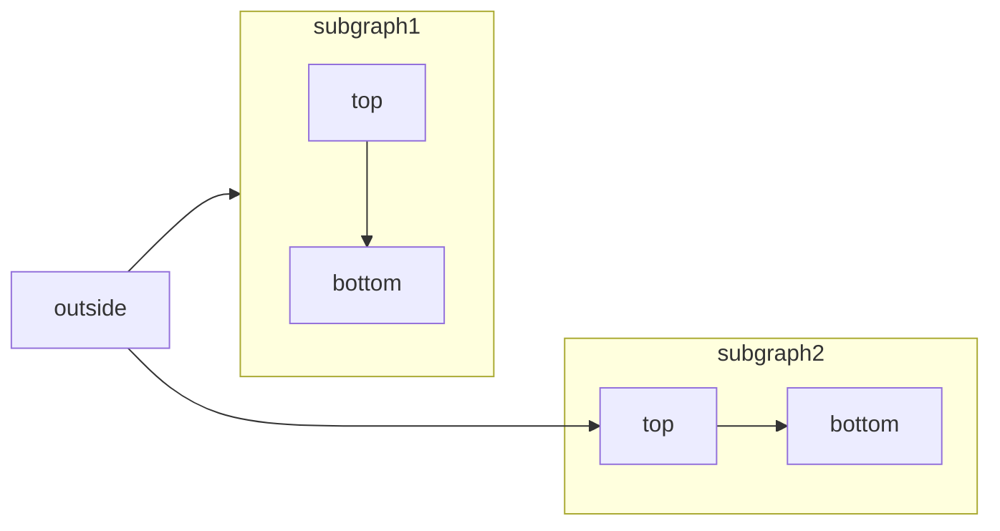

[Mermaid](https://mermaid.js.org/) を使うと、テキストとコードでフローチャート、シーケンス図、ガントチャートなどの図を作成できます。

対応する図の種類と構文の一覧は、[Mermaid のドキュメント](https://mermaid.js.org/intro/)を参照してください。



````mdx Mermaid フローチャートの例

````

<div id="syntax">
  ## 構文
</div>

Mermaid のダイアグラムを作成するには、Mermaid のコードブロック内にダイアグラムの定義を記述します。

````mdx
```mermaid
// Your mermaid diagram code here
```
````